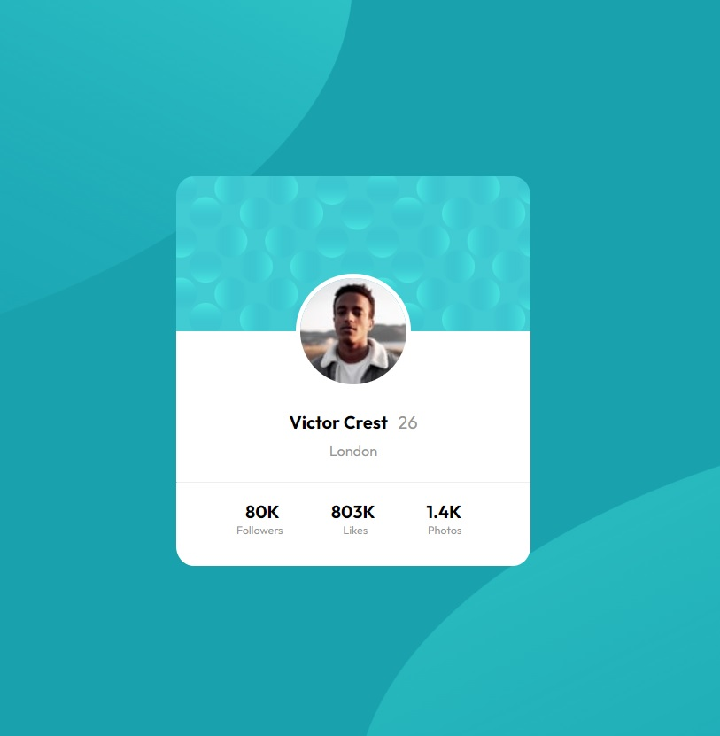

# Frontend Mentor - Profile card component solution

This is a solution to the [Profile card component challenge on Frontend Mentor](https://www.frontendmentor.io/challenges/profile-card-component-cfArpWshJ). Frontend Mentor challenges help you improve your coding skills by building realistic projects. 

## Table of contents

- [Overview](#overview)
  - [The challenge](#the-challenge)
  - [Screenshot](#screenshot)
  - [Links](#links)
- [My process](#my-process)
  - [Built with](#built-with)
  - [What I learned](#what-i-learned)
  - [Continued development](#continued-development)
- [Author](#author)

**Note: Delete this note and update the table of contents based on what sections you keep.**

## Overview

### The challenge

- Build out the project to the designs provided

### Screenshot

### Links

- Solution URL: [https://github.com/Jioh19/profile-card-component-main]
- Live Site URL: [https://jioh19.github.io/profile-card-component-main]

## My process

### Built with

- Semantic HTML5 markup
- CSS custom properties
- Flexbox

### What I learned

Learned to use 2 images in the background along with its interactions.
Still need to learn more, since I wasn´t able to replicate the example.

### Continued development

Still need to learn more, since I wasn´t able to replicate the background example.

## Author

- Frontend Mentor - [@jioh19](https://www.frontendmentor.io/profile/jioh19)

